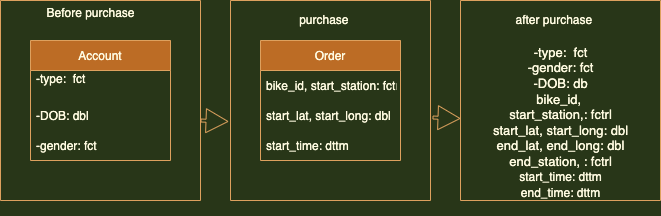

#Documentation
##Domain knowledge
The dataset is from company called Citi Bike based in New York lunched in 2013.  Its as any other company that have a group of bikes locked into a network of docking stations around the city. The bikes are available 24 hours and make them ideal for people to use from one station and return them to any other stations. The dataset is for around 10 bikes behave during 2018, the data consist from bike id, start time and station, end time and station, also some information about people such as data of birth, gender and Type (Subscriber or customer).

##Business requirements
The following steps are the plan which is made to finish this report.

1-	Understand the business questions from communicating data part1 and part2 in order to make a clear plan for the dataset.

2-	Do some reading about the company to have an idea in order to write a brief domain knowledge.

3-	Clean the dataset to be ready to meet the required business questions.

4-	Making a clear visualisation and what information does it contain as it important to the business.

5-	Writing conclusions and suggesting from the graphs.

##Business processes and data flow 
The diagram below showing  the citi bike company data flow, each step hold some information during the processing and at the end of trip which is the final component will hold all customer date, this can help the company to do further analysis to improve their profit.





##Data visualisation as a tool for decision-making 

The graphics and the table in this report can help NYC Citi Bikes to understand their customer behave, who is used their system, for example age and stations plots could make clear idea where is the weak point and the citi bikes can improve these points which will improve the overall bikes profit.

##Data types

From the dataset and the diagram above there are three different types of data

1-	Double (dbl)

2-	Factors (fctr)

3-	Posixct (dttm), it’s a date and time used the format of IOS standred  

##Data quality and data bias

There are two a little concern in the dataset, one of them is the age, the graph shows that there is age over 120 used the bikes this could be mistake so its removed from the graph.

The second concern is the gender, there are some people with Unknown gender, this made me unsure if I remove it from the plot or not.  therefore more investigations will be useful to check and see where is the problem such as the system. 


#Data cleaning
**Preparing data for visualisation (1.7)**

1- Trying to find if there is any missing value in any column.

2- Adding a new columns from the start time column such as year, month and weekday.

3- Calculate the age from the birth and start time columns.

4- Limited the age plot to show only those less than 100 age.

#Data visualisation
**Process and design (2.1, 2.7, 2.8, 2.9)**
After I cleaning the dataset and make it ready for the analysis, I plotted the results on different charts to meet or answer the business question also make sure the graph is clear show the message that I want to deliver. Also, planning to write a short description for each graph. All graphs are made by RStudio using ggplot.

**Visualisations (2.2, 2.3, 2.4, 2.5, 2.6)**

```{r, warning=FALSE, message=FALSE, echo=FALSE}
library(feasts)
library(leaflet)
library(tidyverse)
library(lubridate)
library(tsibble)
 library(tsibbledata)
nyc_bikes_df <- nyc_bikes
#nyc_bikes_df
```

```{r, echo=FALSE}
theme <- function(){
  theme(
        legend.key = element_rect(fill = "grey15"),
        panel.border = element_blank(),
        panel.grid.major = element_line(color = "grey25"),
        panel.grid.minor = element_blank(),
        legend.position = "none",
        axis.title = element_text(face = "bold"),
        plot.title = element_text(face = "bold")
  )
}
```

The table below is for testing the dataset and make sure its create a year, month and weekday from start time column.
```{r, echo=FALSE}
nyc_bikes_df <- nyc_bikes_df %>% 
  mutate(year = year(start_time),
         month = month(start_time, label = TRUE),
         weekday = weekdays(start_time, abbr = TRUE)) 
nyc_bikes_df %>% 
  select(year,month,weekday)
```
The table below is also to test the dataset and make sure its create the age column from birth and start time columns
```{r, echo=FALSE}
nyc_bikes_df <- nyc_bikes_df %>% 
        mutate( age = (year - birth_year)
                )
nyc_bikes_df %>% 
  select(birth_year, start_time, age)
```

##Bikes hired over 2018
The graph is a line graph to show the trend of the bike hired over 2018. The graph is clear show that the summer time is reach the peak. so what, this graph can be useful for  the business to do more advertisements or discount in winter and preper its self in summer time to make sure the have enugh bikes in their stations.
```{r, echo=FALSE}
 nyc_bikes_df %>%
    index_by(month) %>% 
  summarise(num_hire = n()) %>% 
   ggplot() +
  aes(x = month, y = num_hire) +
   geom_point() +
  geom_line(group = 1) +
  labs(
    title = "Number of bikes hired over 2018",
    x = "2018",
    y = "number of hires"
  ) 
```


##Hire bikes by gender
The graph is a bar chart   to show the difference of the bike hire by gender during 2018. The graph is clear show that the men are hiring bikes more than women in 2018. so what, this graph can be useful for  the business to do more investigation why this happen or could to do more advertisements in the way thats weman liked
```{r, echo=FALSE}
  nyc_bikes_df %>% 
  group_by(gender) %>% 
  summarise(n = n()) %>% 
      ggplot() +
  aes(x = gender) +
  geom_bar() +
  labs(
    title = "bikes hires by gender in 2018"
  )
```

##The graph shows the different between people
The graph is a bar chart  to show the difference of the bike hired by the type of people for example subscriber or a new customer? during 2018. The graph is clear show that the subscriber are hiring bikes more than customer . so what, this graph can be useful for  the business to do more advertisements and make some discount for example to improve the overall profit.
```{r, echo=FALSE}
  nyc_bikes_df %>% 
  group_by(type) %>% 
  summarise(n = n()) %>% 
      ggplot() +
  aes(x = type) +
  geom_bar() +
  labs(
    title = "bikes are hired by the type of people in 2018",
    x = "",
    y = "The number of people"
  )
```

##The graph showes the hires by age
The graph is a bar chart  used geom col  to show the difference of the bike hired by the age of people during 2018. The graph is
limited the age for those who is only less than 100 age as there is age around 130 which decided not to shows. it’s clear showing that the young people are less hiring bikes for those age 30 -35. so what, this graph can be useful for  the business to do more advertisements for example university and or high schools or make some discount for young people

```{r, echo=FALSE}
nyc_bikes_df %>% 
   filter(age <= 100) %>%
index_by(age) %>% 
 summarise(num_hire = n()) %>%
   ggplot() +
  aes(x = age, y = num_hire) +
   geom_col() +
  labs(
    title = "Age of hires over 2018",
    x = "Age",
    y = "number of hires"
  )
```


##The top 20 busiest start station in 2018
The graph is a line graph to show the difference of the bike hired in the busines stations during 2018. The graph is
limited to the top 20 busiest start station in 2018. it’s clear showing that the 3186 station has more demand comparing to 3209 and 3279. so what, this graph can be useful for  the business to do more investigation to answer the question why is this happen. for example might the station location not useful or not in the right place.

```{r, echo=FALSE}
nyc_bikes_df %>% 
   index_by(year) %>% 
  group_by(start_station) %>% 
 summarise(num_hire = n()) %>%
  arrange(desc(num_hire)) %>% 
  slice(1:20) %>% 
   ggplot() +
  aes(x = start_station, y = num_hire) +
   geom_point() +
  geom_line(group = 1) +
  labs(
    title = "The top 20 busiest start station in 2018",
    x = "\nstart station",
    y = "number of bikes"
  )
```


##The geographical spread of the station 
The leaflet below show the location or the geographical spread of the stations for the business. from this map the company can clearly show its stations location and what could be improve to add or change station location depend on the map
```{r, echo=FALSE}
nyc_bikes_df %>%
  leaflet()  %>%
   addTiles() %>%
  addCircleMarkers(lng = ~start_long,
                   lat = ~start_lat,
             popup = ~start_station,
             radius = 6
             )
```


